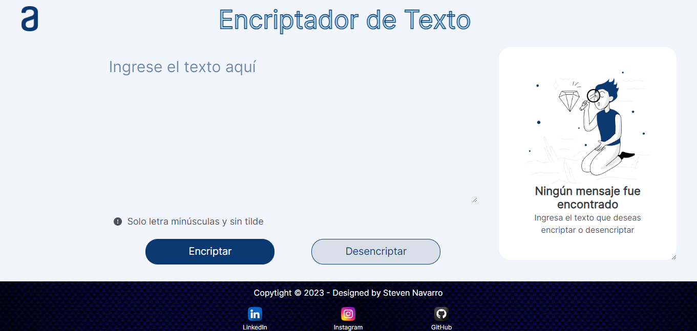
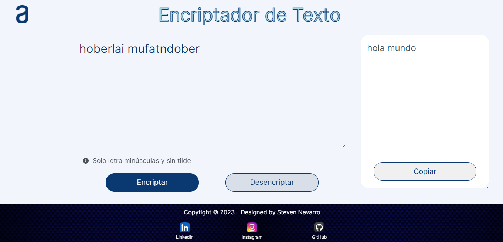

# Challengue-Encriptador-de-Texto
Este es un proyecto web de encriptado de texto desarrollado con HTML5, CSS3 y JavaScript. Ofrece funcionalidades para encriptar y desencriptar texto ingresado por el usuario.

## Requisitos previos

Antes de ejecutar el proyecto, asegúrate de tener instalado lo siguiente:

1. Visual Studio Code
2. Un Navegador (de preferencia Chrome)

## Capturas de pantalla

A continuación, se muestran algunas capturas de pantalla del funcionamiento del proyecto:

1. Página de inicio:

	

2. Funcionamiento encriptar:

	

3. Funcionamiento desencriptar:

	

## Pruébalo

https://steven-navarro.github.io/Challengue-Encriptador-de-Texto/
